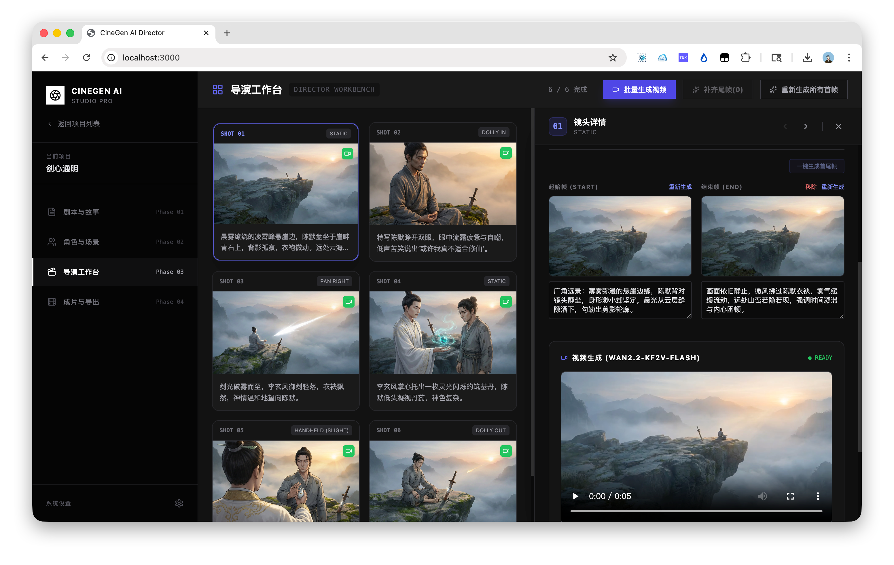

# CineGen AI Director (AI 漫剧工场)

> 个人学习版支持通过本机服务配置 OpenAI 兼容的文本与图片模型：GPT 剧本分析与导演台拆解、图片故事板生成、失败重试、版本保留，以及按中文项目/场次目录保存到 D 盘。设置、DPAPI 安全边界和本地启动方式见 [OpenAI 兼容服务本地接入](./docs/openai-local-setup.md)。GitHub Pages 仅托管静态前端，不能托管保存/测试 Key 所需的 Express API 或 DPAPI 服务。

> 同时欢迎试用一站式的漫剧制作平台 [AniKuku AI 漫剧制作平台](https://anikuku.com/?github)  - use `CINEGEN50OFF` checkout for 50%OFF。
> **AniKuku 提供的优惠码，首次购买，结账时使用 `CINEGEN50OFF` 可以获得 50% 折扣（5 折）**

[中文](./README.md) ｜ [English](./README_EN.md) ｜  [日本語](./README_JA.md) ｜  [한국인](./README_KO.md)

**CineGen AI Director** 是一个专为 **AI 漫剧 (Motion Comics)**、**动态漫画**及**影视分镜 (Animatic)** 设计的专业生产力工具。

它摒弃了传统的“抽卡式”生成，采用 **"Script-to-Asset-to-Keyframe"** 的工业化工作流。通过本机可配置的文本与图片模型，帮助维持角色一致性、场景连续性和镜头规划；视频模型入口目前仍未配置。

> **工业级 AI 漫剧与视频生成工作台**
> *Industrial AI Motion Comic & Video Workbench*

## 核心理念：关键帧驱动 (Keyframe-Driven)

传统的 Text-to-Video 往往难以控制具体的运镜和起止画面。CineGen 引入了动画制作中的 **关键帧 (Keyframe)** 概念：
1.  **先画后动**：先生成精准的起始帧 (Start) 和结束帧 (End)。
2.  **镜头规划**：以关键帧和镜头描述组织后续制作；视频模型将在未来版本接入。
3.  **资产约束**：所有画面生成均受到“角色定妆照”和“场景概念图”的强约束，杜绝人物变形。

## 核心功能模块

### Phase 01: 剧本与分镜 (Script & Storyboard)
*   **智能剧本拆解**：输入小说或故事大纲，AI 自动拆解为包含场次、时间、气氛的标准剧本结构。
*   **视觉化翻译**：自动将文字描述转化为专业的 Midjourney/Stable Diffusion 提示词。
*   **节奏控制**：支持设定目标时长（如 30s 预告片、3min 短剧），AI 自动规划镜头密度。

### Phase 02: 资产与选角 (Assets & Casting)
*   **一致性定妆 (Character Consistency)**：
    *   为每个角色生成标准参考图 (Reference Image)。
    *   **衣橱系统 (Wardrobe System)**：支持多套造型 (如：日常、战斗、受伤)，基于 Base Look 保持面部特征一致。
*   **场景概念 (Set Design)**：生成环境参考图，确保同一场景下的不同镜头光影统一。

### Phase 03: 导演工作台 (Director Workbench)
*   **网格化分镜表**：全景式管理所有镜头 (Shots)。
*   **精准控制**：
    *   **Start Frame**: 生成镜头的起始画面（强一致性）。
    *   **End Frame**: (可选) 定义镜头结束时的状态（如：人物回头、光线变化）。
*   **上下文感知**：AI 生成镜头时，会自动读取 Context（当前场景图 + 当前角色特定服装图），彻底解决“不连戏”问题。
*   **视频生成**：入口预留为未来扩展，本版本尚未配置可用的视频模型。

### Phase 04: 成片与导出 (Export)
*   **实时预览**：时间轴形式预览当前项目素材。
*   **资产导出**：支持导出已生成的关键帧，方便导入 Premiere/After Effects 进行后期剪辑。

## 技术架构

*   **Frontend**: React 19, Tailwind CSS (Sony Industrial Design Style)
*   **Local API**: Express（默认仅监听 `127.0.0.1`）
*   **AI Models**: 独立可配置的 OpenAI 兼容文本和图片服务；视频模型暂未配置
*   **Secret Storage**: Windows DPAPI `CurrentUser` 加密的本机设置文件；浏览器与构建产物不保存 API Key
*   **Project Storage**: 本地浏览器项目数据与本机素材目录

## 快速开始

1.  **启动本机服务**: Windows 可直接双击项目根目录的 `一键启动CineGen.cmd`；也可手动执行 `npm install` 和 `npm run dev:local`，然后打开 `http://localhost:3000`。
2.  **独立配置服务**: 在“系统设置”中分别保存文本和图片服务的 Base URL、模型名与 API Key；可先测试连接。不要把 Key 放入浏览器或项目代码。
3.  **故事输入**: 在 Phase 01 输入你的故事创意，点击“AI 剧本分析”。
4.  **美术设定与分镜制作**: 确认剧本后，进入导演工作台生成和管理故事板版本。
5.  **视频入口**: 本版本尚未配置视频生成服务，相关入口为未来扩展。

## License / 许可证

本项目的开源许可说明请参考仓库中的 License 页面：

[查看 CineGen AI Director License](https://github.com/UllrAI/CineGen-ShortDrama?tab=License-1-ov-file)

请在使用、修改、分发或商业化使用本项目代码前，仔细阅读并遵守对应许可证条款。

## AniKuku

**AniKuku AI 漫剧制作平台** 也可提供商业化部署/私有化部署，完整包含多租户、用户系统、支付等 SaaS 能力。用于 SaaS 运营或企业内生产流程，支持品牌定制或授权合作，AniKuku 的相关商业部署与授权方案亦可联系此邮箱。

## 联系方式

具体合作方式、部署方案与授权范围，可以通过邮件联系：

**[visoar@ullrai.com](mailto:visoar@ullrai.com)**

---
*Built for Creators, by CineGen.*

[阿尼酷酷](https://anikuku.com/?github-cn)
